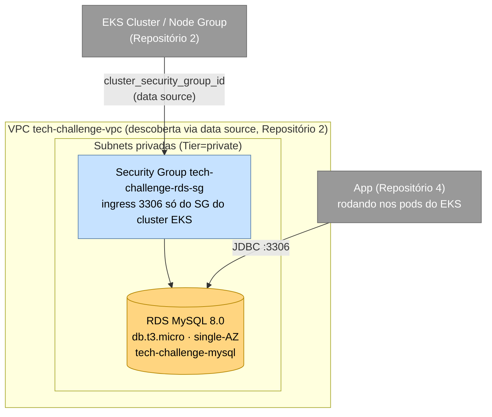

# fiap-tech-challenge-database-infrastructure

Infraestrutura do banco de dados gerenciado (Amazon RDS) do Tech Challenge Fase 3 — FIAP Pós-Tech, Arquitetura de Software, turma 15SOAT. Repositório 3 dos 4 exigidos pela Fase 3: provisiona, via Terraform, o banco MySQL usado pela [aplicação principal](https://github.com/Adriana-Meyer/fiap-tech-challenge-pos-tech), substituindo o MySQL que rodava como pod dentro do cluster (Fase 2) por uma instância gerenciada.

## Tecnologias

| Camada | Tecnologia |
|---|---|
| Provisionamento | Terraform >= 1.5, providers `hashicorp/aws`, `hashicorp/random` |
| Nuvem | AWS (conta acadêmica AWS Academy Learner Lab) |
| Banco | Amazon RDS for MySQL 8.0 |
| CI/CD | GitHub Actions |

## Por que RDS gerenciado (em vez de MySQL em pod)

Nas fases anteriores, o MySQL rodava como um Deployment dentro do próprio cluster Kubernetes (`k8s/02-mysql/` no repositório da App), com um PVC para persistência — funcional para desenvolvimento local, mas com limitações reais para produção: backups, patching de segurança, monitoramento de storage/IOPS e recuperação de falhas ficavam todos por conta da aplicação. Um banco gerenciado resolve isso nativamente:

| Critério | Justificativa |
|---|---|
| **Backups automáticos** | RDS faz snapshot automático diário e permite restore point-in-time, sem esforço operacional adicional. |
| **Isolamento de rede** | A instância fica em subnets privadas, sem IP público, acessível só a partir do security group do cluster EKS (Repositório 2) — reduz superfície de ataque. |
| **Separação de responsabilidade de infraestrutura** | Ciclo de vida do banco (upgrade de versão, storage, manutenção) desacoplado do ciclo de vida do cluster/aplicação — alinhado com a divisão em repositórios pedida pela Fase 3. |
| **Continuidade com a escolha já feita nas fases anteriores** | O motor continua MySQL 8 — mesma justificativa relacional/ACID/Flyway já documentada no [README da App](https://github.com/Adriana-Meyer/fiap-tech-challenge-pos-tech#modelagem-do-banco-de-dados); só o *onde* roda o banco muda, não o modelo de dados. |

O modelo de dados (diagrama ER completo e explicação dos relacionamentos) é mantido centralizado no repositório da App: [`docs/`](https://github.com/Adriana-Meyer/fiap-tech-challenge-pos-tech/tree/main/docs).

## Arquitetura



**Decisões de desenho** (detalhadas nos ADRs/RFCs centralizados no repositório da App):
- **Descoberta de rede sem acoplamento de pipelines**: este repositório não lê o state do Repositório 2 nem depende da ordem de execução das pipelines — ele localiza a VPC, as subnets privadas (tag `Tier=private`) e o security group do cluster através de `data "aws_eks_cluster"` pelo nome fixo `tech-challenge-eks`. Só é preciso que o Repositório 2 já tenha sido aplicado ao menos uma vez na mesma conta/sessão AWS.
- **Single-AZ, sem Multi-AZ**: Multi-AZ dobraria o custo sem necessidade real para um projeto acadêmico.
- **`db.t3.micro`, storage gp2**: dentro dos limites do AWS Academy Learner Lab (instâncias de banco só nano/micro/small/medium; storage só gp2, até 100GB).
- **Enhanced Monitoring desligado** (`monitoring_interval = 0`): não é suportado no Learner Lab.
- **Sem IP público**: acesso só de dentro da VPC, restrito ao security group do cluster EKS.

## Pré-requisitos

- Terraform >= 1.5
- Conta AWS Academy Learner Lab **ativa** (sessão de 4h) com credenciais temporárias exportadas
- Repositório 2 (`fiap-tech-challenge-kubernetes-infrastructure`) já aplicado na mesma sessão/conta

## Executando

```bash
export AWS_ACCESS_KEY_ID=...
export AWS_SECRET_ACCESS_KEY=...
export AWS_SESSION_TOKEN=...

terraform init
terraform plan
terraform apply
```

> **Nota**: como o state é local (existe só dentro do runner que rodou o `apply`, não persiste em lugar nenhum), rodar `apply` fora do workflow de CI (`terraform-apply.yml`) deixa o Terraform sem memória do que já existe na AWS — um segundo `apply` "do zero" contra um banco que já existe tende a falhar por conflito de nome, em vez de simplesmente atualizar. Por isso o fluxo real de uso é sempre pelo `workflow_dispatch` no GitHub Actions, não localmente.
>
> No `apply` via CI, o endpoint/usuário/senha do banco são enviados **automaticamente** como Secrets do Repositório 4 (`RDS_DATASOURCE_URL`/`RDS_USERNAME`/`RDS_PASSWORD`, via `gh secret set` — nunca aparecem em log nenhum) — não precisa mais copiar `terraform output` manualmente.

Para desativar tudo ao final da sessão de estudo (economiza orçamento do Lab):

```bash
terraform destroy
```

> **Atenção**: mesmo parada (`stop`), uma instância RDS reinicia automaticamente pela AWS após 7 dias parada, voltando a gerar custo. Preferir `terraform destroy` entre sessões de estudo, já que os dados são apenas de demonstração.

## CI/CD

- **`terraform-validate.yml`** — roda em todo push/PR para `develop`/`main`: `terraform fmt -check`, `terraform init -backend=false`, `terraform validate`. Não precisa de credenciais AWS.
- **`terraform-apply.yml`** — disparo manual (`workflow_dispatch`), com escolha entre `plan`/`apply`/`destroy`. Usa credenciais temporárias da sessão AWS Academy via GitHub Secrets (`AWS_ACCESS_KEY_ID`, `AWS_SECRET_ACCESS_KEY`, `AWS_SESSION_TOKEN`) — precisam ser atualizadas a cada nova sessão do Lab. Fica `workflow_dispatch` manual permanentemente, inclusive no estado final entregue: essa é a alternativa adotada para economizar os recursos limitados do Lab (sessão de ~4h) — o deploy em si é automático de ponta a ponta assim que disparado, sem nenhuma intervenção manual durante a execução; só o gatilho é manual, para ser acionado quando for conveniente e a sessão do Lab estiver ativa.

## Variáveis Terraform

Todas têm valor padrão (ver [`variables.tf`](variables.tf)) e reaproveitam os mesmos nomes já usados pela App (`workshop_db`/`workshop`), para minimizar mudanças na configuração de conexão quando o Repositório 4 apontar para este banco.

## APIs

Este repositório não expõe API própria — é infraestrutura de banco de dados. A documentação Swagger da aplicação está no [Repositório 4](https://github.com/Adriana-Meyer/fiap-tech-challenge-pos-tech#documenta%C3%A7%C3%A3o-da-api-swagger-ui).
